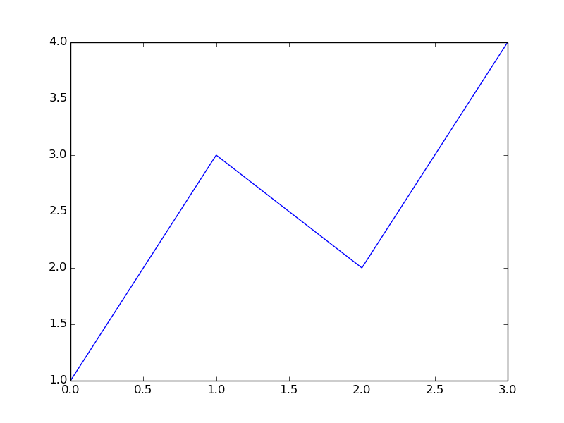
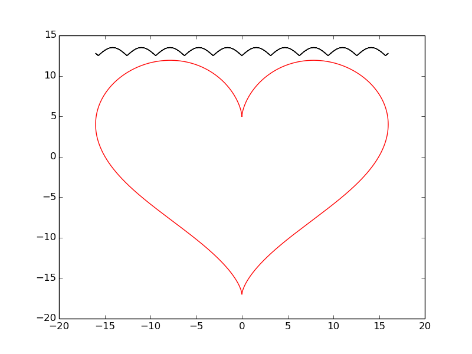
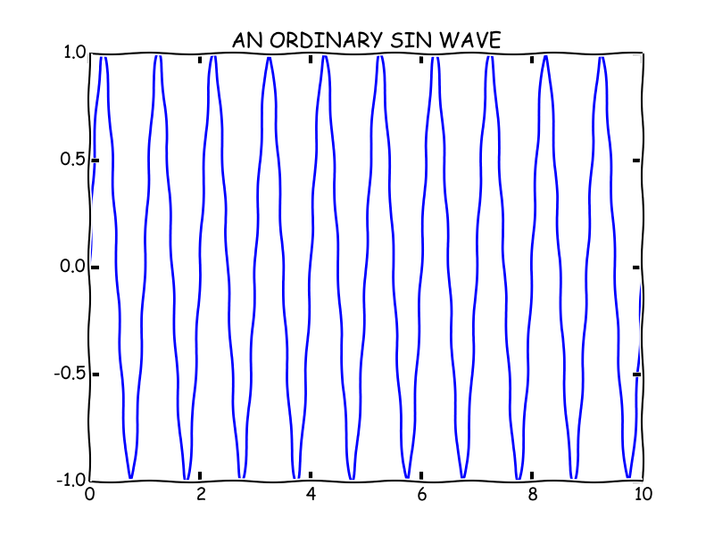
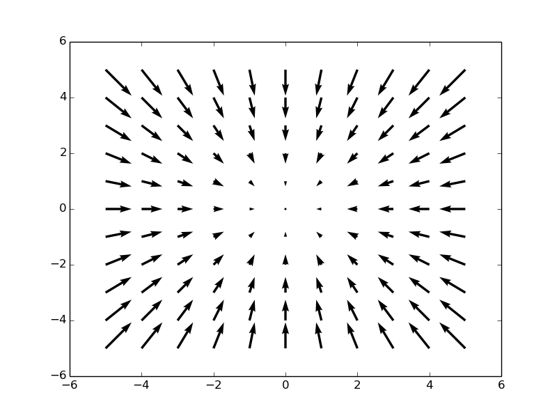

# Matplotlib-cpp

Matplotlib-cpp is a simple C++ plotting library. It is built to resemble the plotting API used by Matlab and matplotlib. 

# Examples

## Example 1

## Example 2

## Example 3

## Example 4

## Example 5

currently doesn't work

# Installation

- cd extern/
- git submodule init/
- git submodule update/
- cmake -S . -B build
- cmake --build build
- cd build && example1

# Knowns Issues

## macOs

1. In matplotlibcpp.h -> change line 29 #include <Python.h> to -> #include <Python/Python.h>

2. WITHOUT_NUMPY is defined
